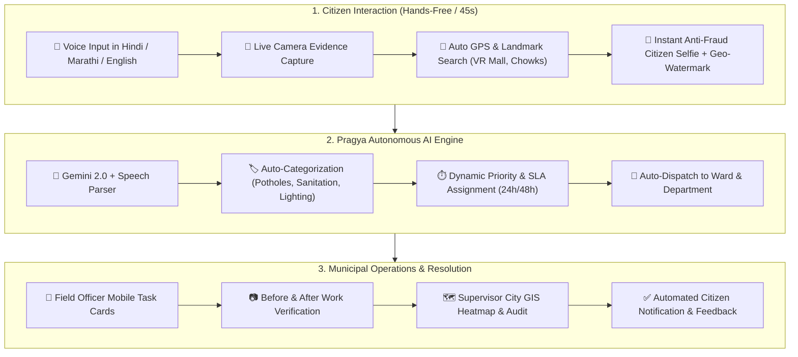

<div align="center">

# 🏛️ PRAGYA (प्रज्ञा)
### Next-Gen Multilingual AI Civic Grievance & Urban Operations Platform
*Empowering citizens • Accelerating municipal action • Transforming city governance*

[](https://reactjs.org/)
[](https://www.typescriptlang.org/)
[](https://vitejs.dev/)
[](https://tailwindcss.com/)
[](https://supabase.com/)
[](https://ai.google.dev/)
[](https://postgis.net/)

---

### 🌐 [Test the Live Project Server (Click to Launch)](http://localhost:5173/)
> **Live Local Development Server**: [http://localhost:5173/](http://localhost:5173/)  
> *Ready out-of-the-box with live voice AI, camera viewfinders, interactive maps, and demo municipal records!*

[](https://vercel.com/new/clone?repository-url=https%3A%2F%2Fgithub.com%2FSejal-lale%2FPragya&env=VITE_SUPABASE_URL,VITE_SUPABASE_ANON_KEY&envDescription=Enter%20your%20Supabase%20Cloud%20credentials&project-name=pragya-civic)

---

</div>

## 🌟 Why Pragya?

In urban centers like **Nagpur**, over **70% of citizens never report civic issues** due to cumbersome complaint forms, language barriers, complex ward selections, and lack of transparency. When complaints are submitted, municipal teams struggle with duplicates, inaccurate descriptions, and missing geo-coordinates.

**Pragya (प्रज्ञा)** changes the equation completely. It turns grievance redressal into a **45-second conversational experience** using speech recognition in **Hindi (हिंदी)**, **Marathi (मराठी)**, and **English**, instant camera evidence capture, automatic GPS pinpointing, and AI-driven department routing.

---

## ⚡ Key Architectural Highlights



---

## 🔥 Groundbreaking Features

### 1. 🎙️ Pragya Voice Assistant (प्रज्ञा आवाज)
* **Auto-Listening Speech Recognition**: The moment you start, the microphone turns on automatically.
* **Conversational Name Parsing**: Natural speech like *"Mera naam Rahul Sharma hai"* or *"Maajha naav Rajesh aahe"* is automatically stripped of filler words to isolate the exact name.
* **Multilingual AI Triage**: Speak naturally in Hindi, Marathi, or English. Pragya translates, categorizes the grievance, assigns urgency, and routes it to the right department in real time.

### 2. 📸 Hardware-Accelerated Camera Viewfinder
* **Instant Problem Capture**: Opens your rear camera directly inside the browser viewfinder with auto-advance upon snapshot or file upload.
* **Zero Delays**: Takes the photo and smoothly flows into the problem description without page reloads.

### 3. 🗺️ Universal GIS & Google Maps-Grade Landmark Search
* **Default Current Location**: Auto-detects device GPS (`navigator.geolocation`) with high accuracy and places a pulsing civic pin.
* **Universal Nagpur Places Search**: Search **any place, mall, cinema, or chowk** with 0ms local catalog speed + live OpenStreetMap & Komoot Photon geocoding:
  * 🏬 **Malls**: VR Mall (Trillium), Eternity Mall, Empress Mall, Poonam Mall, Fortune Mall, Milestone Mall, Jaswant Tawa Mall.
  * 🎬 **Theaters**: Cinepolis, PVR Empress City, Cinemax, INOX Poonam, MovieMax, Alankar Cinema, Liberty, Smruti, Panchsheel, Sudama Talkies, Rajvilas.
  * 🏛️ **Landmarks**: Deekshabhoomi, Futala Lake, Ambazari Lake, Seminary Hills, Zero Mile Stone, Maharajbagh Zoo, Tekdi Ganesh, Koradi Temple, Dragon Palace.
  * 🏥 **Hospitals**: GMC Nagpur, Mayo Hospital (IGGMC), AIIMS Nagpur, Kingsway, Orange City Hospital, Care Hospital.
  * 📍 **Major Chowks**: Kamal Chowk, Medical Square, Variety Square, Shankar Nagar, Law College, Chhatrapati Square, Pratap Nagar, Indora, Kadbi Chowk, Baidyanath Square.
* **Interactive Leaflet Map**: Drag the pin anywhere to adjust coordinates with real-time ward lookup and street address reverse-geocoding.

### 4. 🛡️ Anti-Fraud Citizen Verification Selfie
* **Live Camera Only**: To eliminate fake complaints, bot spam, and impersonation, **file uploads from the gallery are strictly disabled**.
* **Live Dynamic On-Canvas Geo-Watermarking**: Burns real-time cryptographic metadata directly into the pixels:
  * Exact GPS Coordinates (Latitude, Longitude)
  * Reverse-Geocoded Nagpur Street Address & Ward
  * Instant ISO Timestamp
  * Official **"PRAGYA CITIZEN VERIFICATION • ON-SITE STAMP"** Seal.

### 5. 🏢 Role-Based Municipal Command Center
* **👤 Citizen Portal**: File grievances in 45 seconds, track status via live timeline, inspect assigned officer details, and view SLA countdowns.
* **👷 Field Employee Dashboard**: View allocated ward tasks, get turn-by-turn GIS coordinates, capture "After-Repair" verification photos, and resolve tickets.
* **📊 Supervisor GIS Command Center**: City-wide heatmap of open complaints, SLA breach escalation alerts, verification queue, and department efficiency scorecards.

---

## 🚀 Quickstart Guide (Run in 60 Seconds)

### Prerequisites
* [Node.js](https://nodejs.org/) (v18 or higher)
* [npm](https://www.npmjs.com/) or `pnpm`

### 1. Clone & Install
```bash
git clone https://github.com/Sejal-lale/Pragya.git
cd Pragya
npm install
```

### 2. Configure Environment Variables
Copy the template and add your credentials (or run in offline demo mode):
```bash
cp .env.example .env
```

Edit `.env`:
```env
# Supabase Cloud Database & Auth
VITE_SUPABASE_URL=https://your-project.supabase.co
VITE_SUPABASE_ANON_KEY=your-supabase-publishable-key

# Google Gemini Flash (Optional for advanced AI classification)
VITE_GEMINI_API_KEY=your-gemini-api-key
```

### 3. Launch Development Server
```bash
npm run dev
```
Open **[http://localhost:5173/](http://localhost:5173/)** in your browser!

### 4. Build & Deploy to Vercel
```bash
# Build locally
npm run build
npm run preview

# Deploy to Vercel via CLI
npx vercel

# Deploy directly to production
npx vercel --prod
```

> **Or Deploy via Vercel Web Dashboard (1-Click)**:
> 1. Go to [https://vercel.com/new](https://vercel.com/new) and import `Sejal-lale/Pragya`.
> 2. Add Environment Variables: `VITE_SUPABASE_URL` and `VITE_SUPABASE_ANON_KEY`.
> 3. Click **Deploy**. Vercel uses the committed `vercel.json` for automatic SPA routing and Edge CDN caching!

---

## 👥 Demo Personas to Try

Switch between personas using the top navigation bar:

| Role | Persona | Features to Test |
| :--- | :--- | :--- |
| **Citizen** | *Sneha Patil* | Tap **"Tell Pragya what's wrong"** • Try voice in Hindi/Marathi • Search "VR Mall" or "Kamal Chowk" • Snap live watermarked selfie. |
| **Field Worker** | *Rahul Sharma (EMP-R042)* | Review road repair tasks • View turn-by-turn GPS location • Submit resolution photo. |
| **Supervisor** | *Kavita Deshmukh* | Inspect city-wide GIS heatmap • Check SLA countdown timers • Approve employee resolutions. |

---

## 📂 Project Structure

```
Pragya/
├── src/
│   ├── components/
│   │   ├── citizen/             # Citizen experience & voice assistant modal
│   │   │   ├── GuidedAssistantModal.tsx  # 6-step automated grievance flow
│   │   │   ├── HomeScreen.tsx            # Citizen hero, categories & stats
│   │   │   ├── MyComplaintsScreen.tsx    # Live tracking & timelines
│   │   ├── employee/            # Field officer task cards & resolution
│   │   ├── supervisor/          # City GIS heatmap & verification queue
│   │   └── shared/              # Navigation, headers & toast notifications
│   ├── services/
│   │   ├── locationService.ts   # Nagpur catalog (malls, theaters, chowks) + Nominatim & Photon
│   │   └── aiClassifierService.ts# Gemini 2.0 Flash + heuristic NLP triage
│   ├── utils/
│   │   └── cameraUtils.ts       # Video stream control & live canvas geo-watermarking
│   ├── context/
│   │   └── StoreContext.tsx     # Supabase sync + offline reactive store
│   └── types.ts                 # TypeScript data contracts & schemas
├── supabase/
│   ├── RUN_IN_SUPABASE_SQL_EDITOR.sql # Database schema, triggers & RLS policies
│   └── migrations/              # Incremental SQL migration scripts
├── public/                      # Static assets & municipal iconography
├── package.json
└── vite.config.ts
```

---

## 🗄️ Database & Security Architecture

* **PostgreSQL + PostGIS**: Native spatial tables storing geographic coordinates for complaints, municipal wards, and zones.
* **Row Level Security (RLS)**: Enforced policies ensuring citizens only edit their own grievances while supervisors retain audit access.
* **Foreign Key Normalization Trigger**: Automatically translates human-readable ward titles (e.g. `"Ward 12, Dharampeth"`) into valid normalized primary keys (`"ward-12"`).

---

## 🤝 Contributing

Contributions to improve municipal governance and citizen welfare are warmly welcome!
1. Fork the Project
2. Create your Feature Branch (`git checkout -b feature/AmazingFeature`)
3. Commit your Changes (`git commit -m 'Add some AmazingFeature'`)
4. Push to the Branch (`git push origin feature/AmazingFeature`)
5. Open a Pull Request

---

<div align="center">

Built with ❤️ for Nagpur Municipal Corporation & Digital India 🇮🇳  
**[Launch Local Demo Server → http://localhost:5173/](http://localhost:5173/)**

</div>
